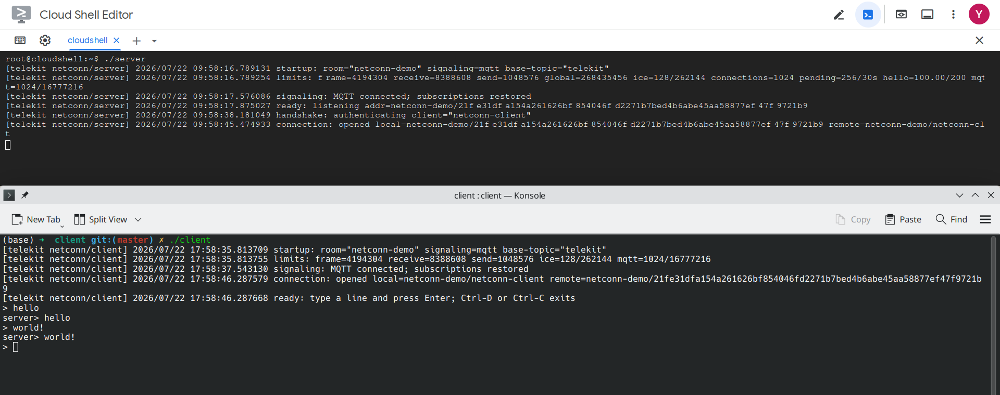

# Telekit

Telekit is a peer-to-peer transport library for Go with built-in authentication and encrypted signaling. It uses MQTT, NATS, Centrifugo, or WebSocket for signaling, then exposes the negotiated transport through standard `net.Conn` and `net.Listener` interfaces.



## Use case

Telekit was built for collecting data from sensors behind NAT. The collector acts as the room server, makes outbound connections only, and does not need a public application listener. Sensors authenticate through a signaling service, use Pion ICE for hole punching, and then negotiate QUIC, KCP, SCTP, or raw UDP.

Compared with a conventional public TCP/UDP service:

|                      | Public TCP/UDP collector                  | Telekit collector                                  |
| -------------------- | ----------------------------------------- | -------------------------------------------------- |
| Application listener | Publicly reachable address and port       | No public application listener                     |
| Discovery            | Clients connect directly to the collector | Both sides connect outward to signaling            |
| Address disclosure   | Endpoint is visible before authentication | ICE data is released only after PSK authentication |
| Data path            | Public server socket                      | Pion ICE path plus QUIC/HTTP/3/KCP/SCTP/Raw UDP    |
| Go integration       | `net.Conn`                                | `net.Conn`                                         |

The trade-off is extra signaling and ICE complexity. Direct connectivity is not guaranteed, and strict or symmetric NATs may require TURN. In addition to the default QUIC transport, applications can select the HTTP/3 transport; unauthenticated HTTP/3 requests can be served by a configured reverse-proxy fallback.

## Architecture

```text
                        Encrypted signaling
                    ┌────────────────────────┐
                    │ MQTT / NATS /          │
                    │ Centrifugo / WebSocket │
                    └───────────┬────────────┘
                                │
                        outbound connections
                                │
        ┌───────────────────────┴───────────────────────────────┐
        │                                                       │
sensor clients behind NAT                          collector server behind NAT
        │                                                       │
        └── Pion ICE >>> QUIC / HTTP/3 / KCP / SCTP / Raw UDP ──┘
```

## Security properties

- PSK authentication finishes before any ICE candidate is disclosed.
- Transport capabilities, selection, ICE credentials, and candidates are encrypted with a derived session key.
- Clients pin the server's Ed25519 public key.
- Each connection uses ephemeral X25519 and HKDF to derive its own session key.
- Post-handshake signaling payloads are authenticated and encrypted, with sequence numbers and replay windows.
- Application and heartbeat frames use directional session keys, authenticated sequence numbers, and the selected transport's own mechanisms.
- HTTP/3 transport data is carried in an authenticated HTTP/3 request body. Invalid HTTP/3 requests are handled by the configured fallback site.

Configure the HTTP/3 transport on the server with a real certificate and an
upstream fallback website:

```go
transporthttp3.New(
    transporthttp3.WithTLSConfig(serverTLSConfig),
    transporthttp3.WithFallbackURL("https://www.example.com"),
)
```

The fallback is only used when the HTTP/3 request does not contain a valid
Telekit session token. The default self-signed certificate is suitable for
development; production deployments should use a certificate matching the
configured server name.

- Frame sizes, buffers, handshakes, connection counts, and request rates are bounded by configuration.

_The signaling service can still observe routing identifiers, timing, and ciphertext sizes, and can drop, delay, replay, or flood messages. STUN/TURN servers see the network information required by their protocols. An authenticated but compromised client can disclose the Candidate information for that connection._

## Signaling adapters

```go
type Adapter interface {
    Connect() error
    Disconnect() error
    Publish(roomID string, typ MessageType, payload []byte) error
    Subscribe(roomID string, typ MessageType, handler Handler) (Subscription, error)
}
```

| Adapter    | Route                         | Default base | Configuration                         |
| ---------- | ----------------------------- | ------------ | ------------------------------------- |
| MQTT       | `{baseTopic}/{room}/{type}`   | `telekit`    | `mqtt.WithBaseTopic(...)`             |
| NATS       | `{baseSubject}.{room}.{type}` | `telekit`    | `nats.NewAdapterWithBaseSubject(...)` |
| Centrifugo | `{baseChannel}:{room}:{type}` | `telekit`    | `centrifugo.WithBaseChannel(...)`     |
| WebSocket  | `{baseURL}/{room}`            | —            | Adapter URL                           |

```go
mqttAdapter, _ := mqtt.NewMQTTAdapter(
    mqttURL,
    mqtt.WithBaseTopic("sensors/telekit"),
)

natsAdapter, _ := nats.NewAdapterWithBaseSubject(
    natsURL,
    "sensors.telekit",
)

centrifugoAdapter, _ := centrifugo.NewAdapter(
    centrifugoURL,
    centrifugo.WithBaseChannel("sensors:telekit"),
)
```

Both peers must use the same base route, and Broker ACLs must authorize it. Each route segment accepts only letters, digits, underscores, and hyphens.

All signaling adapters expose `WithReconnectBackoff(...)`, `WithOnConnect(...)`, `WithConnectionLostHandler(...)`, and `WithReconnectingHandler(...)` (NATS also exposes `WithMaxReconnects(...)`). MQTT uses QoS 1 by default and restores subscriptions after reconnecting. A client also attempts one fresh signaling handshake and ICE negotiation when the application heartbeat declares a data transport dead; this creates a new session and does not resume buffered application data.

## `net.Conn` API

A client dials with a room, timeout, device PSK, and pinned server key:

```go
conn, err := client.Dial(
    "sensor-room",
    30*time.Second,
    adapter,
    peer.PreSharedKey{
        ClientID:        "sensor-01",
        Key:             sensorKey,
        ServerPublicKey: pinnedServerPublicKey,
    },
)
if err != nil {
    return err
}
defer conn.Close()

_, err = io.Copy(conn, sensorReader)

// Select explicitly with a transport implementation when needed:
// &client.Options{Transport: transportkcp.New()}
// nil selects the raw UDP transport.
```

The server validates device keys and accepts standard `net.Conn` values:

```go
listener, err := server.NewListener(
    "sensor-room",
    adapter,
    peer.StaticKeyring{"sensor-01": sensorKey},
    &server.Options{IdentityKey: serverIdentityPrivateKey},
)
if err != nil {
    return err
}
defer listener.Close()

for {
    conn, err := listener.Accept()
    if err != nil {
        return err
    }
    go collect(conn)
}
```

Connections expose only the standard `net.Conn` contract: reads, writes, close, addresses, and read/write deadlines. Data-channel message callbacks are an internal transport detail.

## License

MIT License © 2026 AnyShake Project
